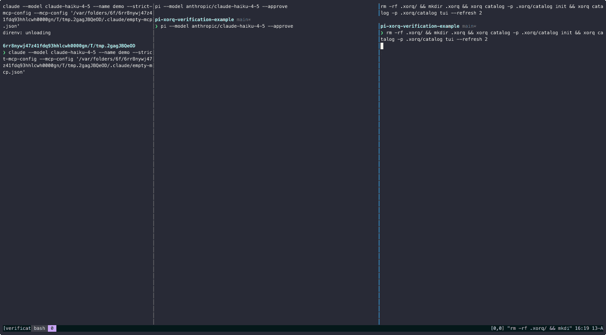

# pi-xorq verification duel

A side-by-side demo of **verified-by-construction data answers**: the same
hallucination-bait question is fed to two coding agents at once, and you watch
one of them answer from memory-ish vibes while the other is forced to *prove*
every number it prints.



```
┌───────────────┬──────────────────────────┬──────────────────────────┐
│ claude (bare) │ pi + xorq verification   │ xorq catalog TUI         │
│ fresh tmp dir │ this repo                │ this repo                │
│ no tools but  │ every number selected    │ watch expressions and    │
│ the basics    │ from a catalog expr and  │ verify-<id> witnesses    │
│               │ re-checked by a          │ appear as the agent      │
│               │ deterministic checker    │ works                    │
└───────────────┴──────────────────────────┴──────────────────────────┘
```

The right pane is the point: verification here is not "the model says it
double-checked." A deterministic Python checker (`pi-xorq-check`) re-runs every
claimed value as a fresh *witness expression* against a re-runnable
[xorq](https://github.com/xorq-labs/xorq) catalog, compares under typed
equality, and folds a verdict (`VERIFIED | DISCREPANCY | COULD-NOT-VERIFY |
NO-OP`). The agent cannot stamp its own answer — the extension's answer gate
re-stamps every terminal answer from the checker's certificate, and even
superlative *wording* ("highest", "second-largest") must be backed by a
discharged `argmax`/`argmin` obligation or the answer is marked **NOT
VERIFIED**. The conceptual model is in
[docs/adr/0001](docs/adr/0001-formal-verification-as-obligation-discharge.md).

## Run it

Requirements: [Nix](https://nixos.org) with flakes, plus the `claude` CLI on
your PATH for the left pane (the duel still works without it — the pane just
errors — but then it's less of a duel).

**First run — log into pi.** pi authenticates per provider; do this once and
the credentials persist:

```bash
nix develop        # python env (xorq + the checker) + pi + tmux, all pinned
pi                 # accept the project-trust prompt (it loads this repo's
                   # .pi extension + skill), then:
                   #   /login   → pick a provider (subscription OAuth or API key)
                   #   /trust   → optionally save the trust decision for future runs
```

(`duel.sh` passes `--approve`, which trusts this repo's project-local files for
that run automatically — the duel never blocks on the prompt either way.)

Prefer env vars? Exporting an API key (e.g. `ANTHROPIC_API_KEY`) before
launching works too — check readiness with
`pi auth check --provider anthropic`. The left pane reuses whatever login your
`claude` CLI already has.

Then:

```bash
./duel.sh          # default trap: denominator-us
```

Both panes are pinned to the **same model** (`claude-haiku-4-5`), so any
difference you watch is the harness — the verification machinery — not the
model. Override pi's side with `PI_MODEL=provider/model ./duel.sh`.

That's it. The script opens the three tmux panes, initializes a fresh catalog,
and types the same prompt into both agents.

Pick the other trap by id:

```bash
python bench/hallucination_prompts.py   # recomputes both oracles from the data
./duel.sh national-sum                  # the memory-prior trap
```

Want just the harness, no duel? `--no-claude` opens two panes — pi and the
catalog TUI — so you watch the verification itself (ingest → compose → verify →
banner, witnesses appearing on the right) without the bare-agent pane:

```bash
./duel.sh --no-claude                   # harness-only view
./duel.sh --no-claude national-sum      # flags and trap ids combine
```

### Record a cast

Recording a live `tmux attach` naively garbles playback: the session resizes
on attach (tmux repaints with absolute cursor moves, so any mid-cast size
change corrupts the replay), and tmux emits escape sequences in your outer
terminal's dialect (ghostty/kitty TERMs bake in sequences the asciinema
player can't render). `record.sh` fixes both — it pins the session at a fixed
geometry before anything boots and records a plain-`TERM` client:

```bash
./record.sh demo.cast                   # the 3-pane duel at 213x50
./record.sh demo.cast --no-claude       # the harness-only view
COLS=180 ROWS=45 ./record.sh demo.cast  # smaller geometry
agg demo.cast demo.gif                  # render a gif (agg is in the shell)
```

Your terminal must be at least as large as the recording geometry, and don't
resize it mid-recording. Detach (`prefix-d`) to stop.

A default `agg` render of a 90-second 213x50 cast is ~8 MB — too heavy for a
README that every clone carries forever. The gif at the top of this one is the
same cast at ~2.6 MB, small type and fewer frames, then requantized:

```bash
agg --font-size 10 --fps-cap 10 --idle-time-limit 1 demo.cast demo.gif
gifsicle -O3 --lossy=90 --colors 48 demo.gif -o demo-small.gif
```

## What the prompts are

The prompts in `bench/hallucination_prompts.py` are **traps with an executable
oracle**: each pins its terms to two real public data files (a farmers-markets
state table and the census NST-EST2025 estimates), so there is exactly one
defensible answer and it is recomputable. A wrong answer is *provably*
hallucinated, not merely disputed.

- **`denominator-us`** (default) — farmers markets per 100,000 U.S. residents
  over matched scopes, both terms pinned: the dataset's total excluding the
  territory rows (7,942) over the census file's own United States row, which
  already excludes them (right: 2.3237). The tempting wrong readings: leave
  the territories in the numerator (2.3243), sum every census row
  (double-counts regions to ~1.37B → 0.5796), or a SUMLEV-40 sum (silently
  includes Puerto Rico → 2.3022).
- **`national-sum`** — the dataset's total number of farmers markets in the
  United States (excl territories): the 50 state + DC rows sum to 7,942. The
  baits: the real-world USDA figure (~8,600–8,700) that saturates the training
  data — answering from memory instead of from the rows — or the whole-file
  total (7,944), which leaves the territory rows in.
- **`denominator-us-semantic`** — the same per-100k question with **no scope
  hints at all**: "(excl territories)" is gone from the prompt. For this trap
  `./duel.sh` pre-seeds the catalog with one reviewed
  [boring-semantic-layer](https://github.com/boringdata/boring-semantic-layer)
  model ([`bench/bsl_us_markets.py`](bench/bsl_us_markets.py)) under the alias
  `us_markets`. The [semantic-model skill](skills/semantic-model/SKILL.md) has
  the harness find the model first, read its dimensions and measures from the
  tag metadata, and query the reviewed `markets_per_100k` measure *by name*
  (right: 2.3237) — the scope decision lives in the measure's definition, so
  answering is a selection. The bare agent gets no such artifact and must
  re-derive the scope unassisted — the tempting mismatched ratios are 2.3243,
  0.5797, and 2.3028. The modeling moved out of the prompt and into a
  reviewed, re-runnable catalog object.

## What to watch for

- **Left (bare claude):** it will fetch the data and compute *something* —
  often a plausible, confidently worded, wrong number (each trap's bait is
  listed in the bench file). Nothing checks it.
- **Middle (pi + verifier):** the analyst role (in [AGENTS.md](AGENTS.md))
  forbids stating any number not obtained via `xorq_select` on a declared
  catalog alias. It ingests the sources into the catalog, composes the metric
  as a catalog expression, declares one proof obligation per claim, and calls
  `xorq_verify`. The checker synthesizes the witnesses, re-runs them, renders
  the certificate card, and the gate stamps the banner.
- **Right (catalog TUI):** the ingested aliases and persisted `verify-<id>`
  witnesses show up live. After the duel you can re-run any witness yourself:
  `xorq catalog run <alias>` — the certificate is re-checkable after the
  agents are gone.

## Using the checker without any LLM

The deterministic checker is the trust root and has no dependency on pi. Gate
any answer-shaped JSON against a catalog:

```bash
# build the tiny offline sample catalog
xorq build sample/flights_pipeline.py --builds-dir .xorq/builds \
  --emit-build-path-to .xorq/last_build.txt
xorq catalog -p .xorq/catalog init
xorq catalog -p .xorq/catalog add "$(cat .xorq/last_build.txt)" \
  -a flights-by-origin --no-sync

pi-xorq-check verify sample/answer_request.json   # print the full certificate
pi-xorq-check gate   sample/answer_request.json   # exit 0 only if VERIFIED/NO-OP
```

`schemas/request.schema.json` and `schemas/certificate.schema.json` are the
contracts.

## What's in here

```
duel.sh                        the demo: three tmux panes, one prompt
bench/hallucination_prompts.py trap prompts + executable oracles (self-checking)
src/pi_xorq_verifier/          the deterministic checker (trust root, plain Python)
  └ prompts/analyst.md         the single role prompt
extensions/xorq.ts             pi extension: xorq_select / xorq_verify / catalog tools
extensions/lib/gate.ts         the answer gate (re-stamps every terminal answer)
skills/xorq-catalog/           catalog orientation skill for pi
schemas/                       request / certificate contracts
AGENTS.md                      the analyst role (pi auto-loads it)
sample/                        offline sample catalog + a worked request
docs/adr/0001                  the verification model, in full
flake.nix                      pinned env: python (xorq + checker), pi, tmux
```

This repo is self-contained: the deterministic checker, the pi extension, the
duel harness, and the formal model (ADR-0001) all live here.

## License

[AGPL-3.0-or-later](LICENSE).
